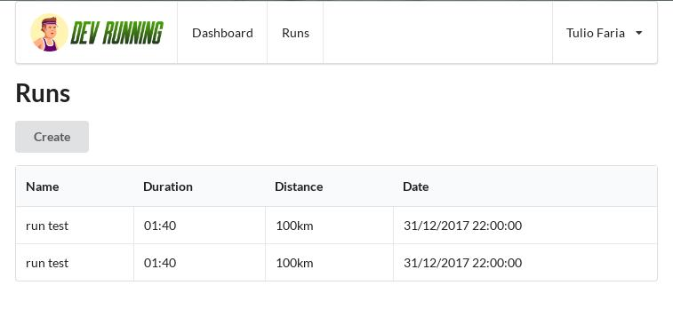

# Dev Running #

A project created in class in `devReactJS` course by [Tulio Faria][1]

* Author: [Francis Rodrigues][2]



## Get Started ##

To start this project, you will need to [clone the API][3] to connect to the database. Don't worry about it. It's a simple sqlite file. :smile:

* Start the database with `npm start` on console

```bash
~$ /devreactjs-bootcamp-runs-server
> node index.js

Server running...
```

* Start the dev-running project with `npm start` on console

```bash
~$ npm start
> dev-running@0.1.0 start /home/paneladm/projects/dev-running

Starting the development server...
```

## References ##

* [Semantic-ui-react][4] - create beautiful, responsive layouts using human-friendly HTML

## License ##

Always MIT

  [1]: https://github.com/tuliofaria
  [2]: https://github.com/francisrod01
  [3]: https://github.com/tuliofaria/devreactjs-bootcamp-runs-server
  [4]: https://react.semantic-ui.com
