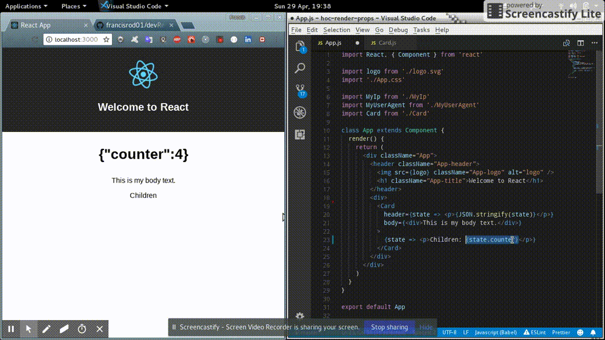

# HoC Render Props #

Working with Higher-Order Components (HOC)

- Author: [Francis Rodrigues][1]

## Concepts ##

### React ###

React - A JavaScript library for building user interfaces

### Higher-Order Component ###

> A higher-order component (HOC) is an advanced technique in React for reusing component logic. HOCs are not part of the React API, per se. They are a pattern that emerges from React’s compositional nature.

Concretely, `a higher-order component is a function that takes a component and returns a new component`.

### Render Props ###

```jsx
import React, { Component } from 'react'
import Card from './Card'

export default class App extends Component {
  render() {
    return (
      <div className="App">
        <header className="App-header">
          
          <h1 className="App-title">Welcome to React</h1>
        </header>
        <div>
          <Card
            header={state => <p>{JSON.stringify(state)}</p>}
            body={<div>This is my body text.</div>}
          >
            {state => <p>Children: {state.counter}</p>}
          </Card>
        </div>
      </div>
    )
  }
}
```

```jsx
import React, { Component } from 'react'


export default class Card extends Component {
  constructor(props) {
    super(props)

    this.state = {
      counter: 0
    }

    setInterval(() => {
      this.setState({
        counter: this.state.counter + 1
      })
    }, 1000)
  }
  render() {
    const { props } = this
    return (
      <div>
        <h1>{props.header(this.state)}</h1>
        <div>{props.body}</div>
        <div>{props.children(this.state)}</div>
      </div>
    )
  }
}
```

**Screenshot:**



## References ##

- [ReactJS][2]
- [Higher-Order Component (HOC)][3]

## License ##

MIT

  [1]: https://github.com/francisrod01
  [2]: https://reactjs.org/
  [3]: https://reactjs.org/docs/higher-order-components.html
