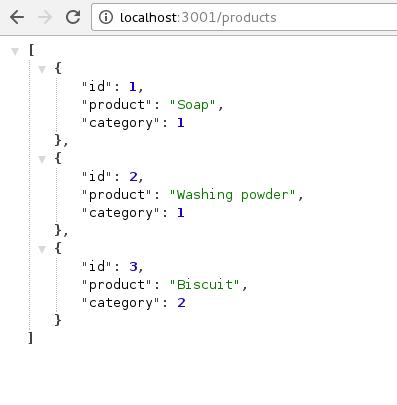

# Products Management #

That project is a part of `devReactJS` class by [Tulio Faria](https://github.com/tuliofaria)

Author: [Francis Rodrigues](https://github.com/francisrod01)


## Get started ##

1. `json-server` as a json database

```bash
~$ yarn global add json-server
```

2. Create a `database.json` file

```js
{
  "products": [],
  "categories": [
    {
      "id": 1,
      "category": "Cleaning",
    },
    {
      "id": 2,
      "category": "Foods"
    }
  ]
}
```

3. Run `json-server` on console like this:

```bash
~$ json-server --watch database.json --port 3001
```

preview:




## License ##

MIT
